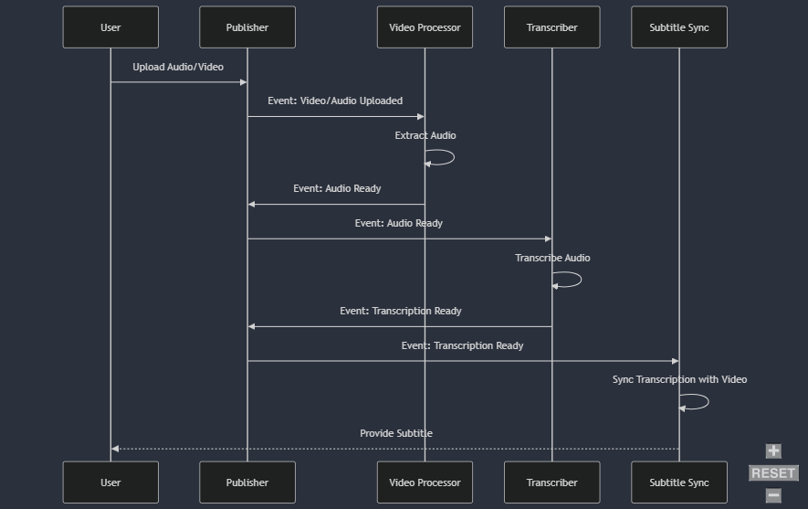

# Laporan Eksperimen: Implementasi Event-Driven Programming dalam Sistem Transkripsi Audio

### Tanggal Eksperimen : 20 September 2024

### Penanggung Jawab : Yahya Alfon Sinaga

### Link ChatGPT : <https://chatgpt.com/share/66ed087c-d560-800e-a134-2de480f62acc>

### **Judul Problem:**  

Implementasi Event-Driven Programming dalam Sistem Transkripsi Audio

### **Deskripsi Eksperimen:**

Tujuan dari eksperimen ini adalah untuk menguji dan memahami penerapan **Event-Driven Programming (EDP)** pada sistem transkripsi audio. Eksperimen ini berfokus pada bagaimana EDP dapat meningkatkan efisiensi, skalabilitas, dan responsivitas sebuah sistem yang memproses file audio secara asinkron dengan menggunakan beberapa komponen yang saling terpisah tetapi tetap bekerja secara terkoordinasi melalui event.

### **Identifikasi Problem:**

- **Konteks Permasalahan:**  
  Dalam banyak kasus industri seperti pengolahan audio, video, atau data dalam skala besar, sering kali diperlukan sistem yang mampu menangani beban kerja secara efisien. Sistem yang memerlukan pengecekan terus-menerus (polling) untuk mengetahui apakah suatu tugas selesai tidak hanya tidak efisien tetapi juga memperlambat kinerja sistem secara keseluruhan.

- **Permasalahan:**  
  Pendekatan polling yang digunakan dalam pengolahan data real-time (seperti transkripsi audio) menghabiskan sumber daya dan memakan waktu karena setiap komponen harus memeriksa status komponen lain secara aktif. Hal ini mengakibatkan **bottleneck** pada sistem, penggunaan CPU dan memori yang berlebihan, serta penundaan dalam proses transkripsi.

- **Solusi:**  
  Solusi yang ditawarkan adalah penerapan **Event-Driven Programming (EDP)**. Dalam EDP, setiap komponen bekerja berdasarkan **event** yang dipicu oleh perubahan status, tanpa perlu pengecekan aktif. Setiap komponen bereaksi terhadap event secara asinkron, sehingga komponen-komponen tersebut dapat bekerja lebih efisien dan tidak saling mengganggu.

### **Metodologi Eksperimen:**

Detail gambar dapat diakses melalui link berikut: [Foto Diagram](https://mermaid.live/view#pako:eNqVVE1PwzAM_StRJCSQhnbPYRIIjkN8jQPqxW28LWJLSuIAE-K_kzRdSUk50Esb573nPNfxJ2-MRC64w1ePusErBRsL-0qz8LRgSTWqBU1s5dAycN273L319U65bYIMixK3ROdgg5fWvCRsH2B95PQe6lrR8u6s5D4piebWmiZQTEfuImwIlZRHC9o1VtUpWbYssQ--JkU7fDjoJoKPaxYDlU6Ek5NUCN_uDEjHwEtl5m_xHAkQd88Xi6EEgq06KLvokE8_yAES4KOyCHb9hppEsjfviL0Kyuwgv9yzoEaoHVuHb9oiw6iS0CP9kG9cSsFuDKn1oU_MKj6ZmSetMXdC7PqDLDSUHP_BmTacEt4jyEPmM_-J__CY0UqDeabeV4b_zf5Z5KbGhGlHR0xLyujC2ajF_uMt79XS3FTS3mROLHS6U4zJ74q2LGvaET8IxHYXsQfjFRh2K81nfI92D0qG2fIZuRUPnvZYcRE-JdiXeKSvgANPJspxQdbjjPtWAh3n0DGIUpGxyzSrupE14-HWPhszQKzxmy0Xa9g5_PoGsIezCg)

Eksperimen ini akan dilakukan dengan langkah-langkah berikut:

- **Langkah 1:** Mengembangkan sistem yang memanfaatkan RabbitMQ sebagai **message broker** untuk menangani event-driven messaging antar komponen, seperti **Publisher**, **Video Processor**, **Transcriber**, dan **Subtitle Sync**.
  
- **Langkah 2:** Mengimplementasikan **Vosk** untuk melakukan transkripsi audio secara offline dan **Pydub** untuk memanipulasi file audio (misalnya konversi stereo ke mono).

- **Langkah 3:** Mengintegrasikan komponen-komponen ini dengan memicu event pada setiap tahap penting dalam pemrosesan (seperti event **"Audio Ready"** ketika audio siap diproses, atau event **"Transcription Ready"** ketika transkripsi selesai).

- **Langkah 4:** Menganalisis hasil kinerja sistem sebelum dan sesudah penerapan EDP, dengan memeriksa penggunaan sumber daya dan waktu pemrosesan.

### **Hasil Eksperimen:**

- **Sebelum Penerapan EDP:**  
  Sebelum menggunakan EDP, sistem bergantung pada pendekatan polling untuk memeriksa status setiap komponen (misalnya, **Transcriber** harus memeriksa apakah audio sudah siap sebelum mulai bekerja). Ini menyebabkan penundaan dalam pemrosesan, pemakaian CPU yang tinggi, dan performa sistem yang lambat.

- **Sesudah Penerapan EDP:**  
  Setelah menerapkan EDP, setiap komponen hanya bekerja saat event yang relevan diterima. Hasilnya menunjukkan peningkatan signifikan dalam **efisiensi sistem**, dengan **pengurangan waktu pemrosesan** dan **penghematan penggunaan sumber daya CPU**. Sistem juga menjadi lebih responsif, dengan setiap komponen langsung bereaksi terhadap event tanpa ada penundaan.

### **Kesimpulan:**

Eksperimen ini berhasil menunjukkan bahwa penerapan **Event-Driven Programming** pada sistem transkripsi audio dapat memberikan peningkatan signifikan dalam hal efisiensi dan responsivitas. EDP memungkinkan setiap komponen sistem untuk bekerja secara asinkron dan hanya memproses data ketika event yang relevan terjadi, sehingga mencegah pemborosan sumber daya dan meningkatkan skalabilitas. **Output dari eksperimen ini sesuai dengan tujuan**, di mana sistem menjadi lebih efisien, hemat sumber daya, dan lebih responsif setelah menerapkan EDP.
