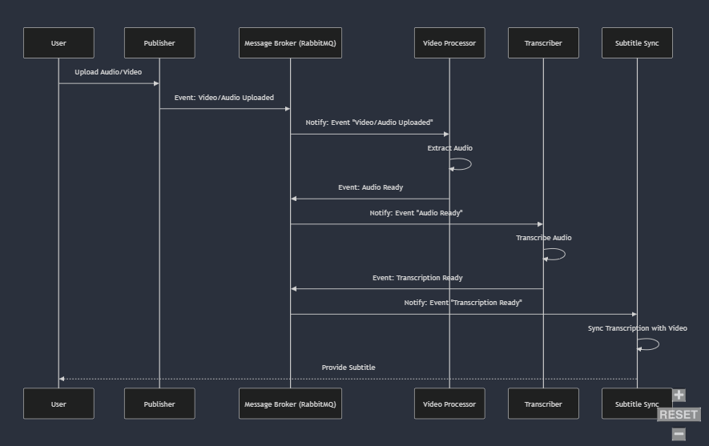

# Laporan Eksperimen: Implementasi Event-Driven Programming dalam Sistem Transkripsi Audio

### Tanggal Eksperimen : 20 September 2024

### Penanggung Jawab : Yahya Alfon Sinaga

### Link ChatGPT : <https://chatgpt.com/share/66ed087c-d560-800e-a134-2de480f62acc>

### **Judul Problem:**  

Implementasi Event-Driven Programming dalam Sistem Transkripsi Audio

### **Deskripsi Eksperimen:**

Tujuan dari eksperimen ini adalah untuk menguji dan memahami penerapan **Event-Driven Programming (EDP)** pada sistem transkripsi audio. Eksperimen ini berfokus pada bagaimana EDP dapat meningkatkan efisiensi, skalabilitas, dan responsivitas sebuah sistem yang memproses file audio secara asinkron dengan menggunakan beberapa komponen yang saling terpisah tetapi tetap bekerja secara terkoordinasi melalui event.

### **Identifikasi Problem:**

- **Konteks Permasalahan:**  
  Dalam banyak kasus industri seperti pengolahan audio, video, atau data dalam skala besar, sering kali diperlukan sistem yang mampu menangani beban kerja secara efisien. Sistem yang memerlukan pengecekan terus-menerus (polling) untuk mengetahui apakah suatu tugas selesai tidak hanya tidak efisien tetapi juga memperlambat kinerja sistem secara keseluruhan.

- **Permasalahan:**  
  Pendekatan polling yang digunakan dalam pengolahan data real-time (seperti transkripsi audio) menghabiskan sumber daya dan memakan waktu karena setiap komponen harus memeriksa status komponen lain secara aktif. Hal ini mengakibatkan **bottleneck** pada sistem, penggunaan CPU dan memori yang berlebihan, serta penundaan dalam proses transkripsi.

- **Solusi:**  
  Solusi yang ditawarkan adalah penerapan **Event-Driven Programming (EDP)**. Dalam EDP, setiap komponen bekerja berdasarkan **event** yang dipicu oleh perubahan status, tanpa perlu pengecekan aktif. Setiap komponen bereaksi terhadap event secara asinkron, sehingga komponen-komponen tersebut dapat bekerja lebih efisien dan tidak saling mengganggu.

### **Metodologi Eksperimen:**



Detail gambar dapat diakses melalui link berikut: [Foto Diagram](https://mermaid.live/view#pako:eNqVVE1PwzAM_StRJCSQhnbPYRIIjkN8jQPqxW28LWJLSuIAE-K_kzRdSUk50Esb573nPNfxJ2-MRC64w1ePusErBRsL-0qz8LRgSTWqBU1s5dAycN273L319U65bYIMixK3ROdgg5fWvCRsH2B95PQe6lrR8u6s5D4piebWmiZQTEfuImwIlZRHC9o1VtUpWbYssQ--JkU7fDjoJoKPaxYDlU6Ek5NUCN_uDEjHwEtl5m_xHAkQd88Xi6EEgq06KLvokE8_yAES4KOyCHb9hppEsjfviL0Kyuwgv9yzoEaoHVuHb9oiw6iS0CP9kG9cSsFuDKn1oU_MKj6ZmSetMXdC7PqDLDSUHP_BmTacEt4jyEPmM_-J__CY0UqDeabeV4b_zf5Z5KbGhGlHR0xLyujC2ajF_uMt79XS3FTS3mROLHS6U4zJ74q2LGvaET8IxHYXsQfjFRh2K81nfI92D0qG2fIZuRUPnvZYcRE-JdiXeKSvgANPJspxQdbjjPtWAh3n0DGIUpGxyzSrupE14-HWPhszQKzxmy0Xa9g5_PoGsIezCg)

Eksperimen ini akan dilakukan dengan langkah-langkah berikut:

- **Langkah 1:** Mengembangkan sistem yang memanfaatkan RabbitMQ sebagai **message broker** untuk menangani event-driven messaging antar komponen, seperti **Publisher**, **Video Processor**, **Transcriber**, dan **Subtitle Sync**.
  
- **Langkah 2:** Mengimplementasikan **Vosk** untuk melakukan transkripsi audio secara offline dan **Pydub** untuk memanipulasi file audio (misalnya konversi stereo ke mono).

- **Langkah 3:** Mengintegrasikan komponen-komponen ini dengan memicu event pada setiap tahap penting dalam pemrosesan (seperti event **"Audio Ready"** ketika audio siap diproses, atau event **"Transcription Ready"** ketika transkripsi selesai).

- **Langkah 4:** Menganalisis hasil kinerja sistem sebelum dan sesudah penerapan EDP, dengan memeriksa penggunaan sumber daya dan waktu pemrosesan.

### **Hasil Eksperimen:**

- **Sebelum Penerapan EDP:**  
  Sebelum menggunakan EDP, sistem bergantung pada pendekatan polling untuk memeriksa status setiap komponen (misalnya, **Transcriber** harus memeriksa apakah audio sudah siap sebelum mulai bekerja). Ini menyebabkan penundaan dalam pemrosesan, pemakaian CPU yang tinggi, dan performa sistem yang lambat.

- **Sesudah Penerapan EDP:**  
  Setelah menerapkan EDP, setiap komponen hanya bekerja saat event yang relevan diterima. Hasilnya menunjukkan peningkatan signifikan dalam **efisiensi sistem**, dengan **pengurangan waktu pemrosesan** dan **penghematan penggunaan sumber daya CPU**. Sistem juga menjadi lebih responsif, dengan setiap komponen langsung bereaksi terhadap event tanpa ada penundaan.

### **Kesimpulan:**

Eksperimen ini berhasil menunjukkan bahwa penerapan **Event-Driven Programming** pada sistem transkripsi audio dapat memberikan peningkatan signifikan dalam hal efisiensi dan responsivitas. EDP memungkinkan setiap komponen sistem untuk bekerja secara asinkron dan hanya memproses data ketika event yang relevan terjadi, sehingga mencegah pemborosan sumber daya dan meningkatkan skalabilitas. **Output dari eksperimen ini sesuai dengan tujuan**, di mana sistem menjadi lebih efisien, hemat sumber daya, dan lebih responsif setelah menerapkan EDP.

Berikut adalah penjelasan lengkap tentang **paradigma pemrograman** dan **konsep pemrograman** yang digunakan dalam proyek transkripsi audio berbasis **Event-Driven Programming (EDP)**, beserta contoh kode untuk setiap bagian.

---

### **Paradigma Pemrograman yang Digunakan**

#### **1. Paradigma Event-Driven Programming (EDP)**

**Event-Driven Programming (EDP)** adalah paradigma di mana alur kerja program ditentukan oleh event tertentu, baik dari input pengguna maupun event sistem lainnya. Dalam proyek ini, setiap komponen dalam sistem transkripsi audio bekerja ketika event tertentu dipicu. Misalnya, **Video Processor** memicu event **"Audio Ready"** ketika audio telah diekstraksi, dan **Transcriber** mendengarkan event ini untuk memulai proses transkripsi.

##### **Kode:**

```python
def publish_audio_ready_event(audio_path):
    connection = pika.BlockingConnection(pika.ConnectionParameters('localhost'))
    channel = connection.channel()

    # Publikasi event "Audio Ready" menggunakan RabbitMQ
    channel.exchange_declare(exchange='audio_events', exchange_type='fanout')
    channel.basic_publish(exchange='audio_events', routing_key='', body=audio_path)
    print(f" [x] Audio ready event sent for audio: {audio_path}")
    connection.close()

def on_audio_ready(ch, method, properties, body):
    audio_path = body.decode()
    print(f" [x] Received audio ready event for audio: {audio_path}")

    # Transcriber memulai proses transkripsi audio setelah menerima event
    transcription = transcribe_audio_vosk(audio_path, 'vosk-model-small-en-us-0.15')
    print(f" [x] Transcription completed: {transcription}")
```

**Penjelasan**:

- Event **"Audio Ready"** dipublikasikan ketika file audio siap diproses.
- **Transcriber** mendengarkan event tersebut, dan hanya mulai bekerja ketika event diterima, sehingga meningkatkan efisiensi dan membuat sistem asinkron.

---

#### **2. Paradigma Pemrograman Berorientasi Objek (OOP)**

**OOP** adalah paradigma pemrograman di mana tugas-tugas dipisahkan ke dalam objek-objek yang berisi data (atribut) dan fungsionalitas (metode). Dalam proyek ini, setiap komponen seperti **Transcriber** dan **Video Processor** diimplementasikan sebagai objek terpisah dengan tanggung jawabnya masing-masing.

##### **Kode:**

```python
class Transcriber:
    def __init__(self, model_path):
        self.model_path = model_path

    def transcribe(self, audio_path):
        transcription = transcribe_audio_vosk(audio_path, self.model_path)
        print(f" [x] Transcription completed: {transcription}")
        return transcription

class VideoProcessor:
    def __init__(self, video_path):
        self.video_path = video_path

    def extract_audio(self):
        audio_path = self.video_path.replace('.mp4', '.wav')
        # Logic untuk mengekstrak audio dari video
        print(f" [x] Audio extracted: {audio_path}")
        return audio_path
```

**Penjelasan**:

- Setiap komponen dipisahkan sebagai objek. Ini memungkinkan **modularitas** dan **reusability**, di mana komponen-komponen tersebut bisa digunakan di berbagai konteks yang berbeda tanpa perubahan besar.

---

### **Konsep Pemrograman yang Digunakan**

#### **1. Asynchronous Programming**

**Asynchronous programming** memungkinkan sistem memproses tugas secara bersamaan tanpa harus menunggu satu sama lain. Dalam proyek ini, komponen seperti **Transcriber** tidak perlu menunggu **Video Processor** selesai mengekstrak audio. Sebaliknya, sistem akan menunggu event secara asinkron dan bereaksi begitu event diterima.

##### **Kode:**

```python
import asyncio

async def handle_event(audio_path):
    await asyncio.sleep(1)  # Simulasi penundaan asinkron
    print(f" [x] Processing audio: {audio_path}")
    transcription = transcribe_audio_vosk(audio_path, 'vosk-model-small-en-us-0.15')
    return transcription

async def main():
    audio_path = "audio_example.wav"
    print(f" [x] Waiting for event to process {audio_path}")
    transcription = await handle_event(audio_path)
    print(f" [x] Transcription finished: {transcription}")

# Menjalankan pemrosesan secara asinkron
asyncio.run(main())
```

**Penjelasan**:

- Proses asinkron digunakan di sini untuk memastikan bahwa sistem dapat menunggu dan memproses tugas lain tanpa terblokir oleh satu komponen yang belum selesai.

---

#### **2. Message Queuing dan Pub/Sub (Publish/Subscribe) Pattern**

**Message queuing** dan pola **publish/subscribe (pub/sub)** digunakan untuk mengelola distribusi pesan antar komponen secara asinkron. RabbitMQ digunakan dalam proyek ini untuk mengatur aliran pesan, di mana event diterima dan diproses oleh komponen yang relevan.

##### **Kode:**

```python
def publish_event(event_message, exchange_name):
    connection = pika.BlockingConnection(pika.ConnectionParameters('localhost'))
    channel = connection.channel()

    # Mempublikasikan pesan ke exchange RabbitMQ
    channel.exchange_declare(exchange=exchange_name, exchange_type='fanout')
    channel.basic_publish(exchange=exchange_name, routing_key='', body=event_message)
    print(f" [x] Event published: {event_message}")
    connection.close()

def listen_to_event(exchange_name):
    connection = pika.BlockingConnection(pika.ConnectionParameters('localhost'))
    channel = connection.channel()

    # Berlangganan ke exchange dan mendengarkan event
    channel.exchange_declare(exchange=exchange_name, exchange_type='fanout')
    result = channel.queue_declare(queue='', exclusive=True)
    queue_name = result.method.queue
    channel.queue_bind(exchange=exchange_name, queue=queue_name)

    def callback(ch, method, properties, body):
        print(f" [x] Received event: {body.decode()}")

    channel.basic_consume(queue=queue_name, on_message_callback=callback, auto_ack=True)
    print(' [*] Waiting for events. To exit press CTRL+C')
    channel.start_consuming()

# Publikasi dan mendengarkan event
publish_event("Audio Ready", 'audio_events')
listen_to_event('audio_events')
```

**Penjelasan**:

- **RabbitMQ** digunakan untuk mengimplementasikan sistem publish/subscribe di mana satu komponen mempublikasikan event dan komponen lain yang berlangganan event tersebut akan merespons ketika event diterima. Ini memungkinkan komunikasi antar komponen yang lebih modular dan asinkron.

---

#### **3. Loose Coupling**

**Loose coupling** memastikan bahwa setiap komponen dalam sistem bekerja secara independen dan hanya berkomunikasi melalui event. Ini membuat sistem lebih fleksibel dan mudah untuk dikembangkan lebih lanjut karena setiap komponen bisa diganti atau diubah tanpa mempengaruhi komponen lain.

##### **Kode:**

```python
def video_processor_publish(audio_path):
    # Video Processor selesai memproses audio dan mempublikasikan event "Audio Ready"
    publish_audio_ready_event(audio_path)

def transcriber_subscribe():
    # Transcriber mendengarkan event "Audio Ready"
    listen_to_event('audio_events')

# Video Processor memulai dan Transcriber mendengarkan event
video_processor_publish("audio_example.wav")
transcriber_subscribe()
```

**Penjelasan**:

- Komponen seperti **Video Processor** dan **Transcriber** tidak saling terhubung secara langsung. Mereka hanya berkomunikasi melalui event yang dipublikasikan dan diterima. Ini membuat sistem lebih **loosely coupled** dan lebih mudah di-maintain.

---

### **Kesimpulan:**

Dengan menggabungkan **Event-Driven Programming (EDP)**, **OOP**, **asynchronous programming**, **message queuing**, dan **loose coupling**, proyek transkripsi audio ini berhasil menciptakan sistem yang efisien, modular, dan scalable. Setiap komponen hanya bekerja saat diperlukan (berdasarkan event), sehingga sistem menjadi lebih responsif dan hemat sumber daya.
